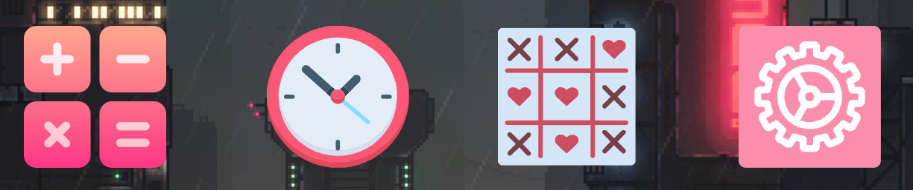

## Projet système d'exploitation JavaScript

<!-- PROJECT LOGO -->
<!-- Test -->
 

  

<h3 align="center">Javascript</h3>

  

    Projet de système d'exploitation en Javascript !
     
    <a href="https://github.com/Aliciasaci/Projet_SE_JS/"><strong>Explorez la doc »</strong></a>
     
     
    <a href="https://mwaa.netlify.app/">Aperçu</a>
    ·
    <a href="https://github.com/Aliciasaci/Projet_SE_JS/issues">Reporter un bug</a>
    ·
    <a href="https://github.com/Aliciasaci/Projet_SE_JS/issues">Demander une nouvelle fonctionnalité</a>
  

  
Table des matières

  <ol>
    <li>
      <a href="#a-propos-du-projet">À propos du projet</a>
      <ul>
        <li><a href="#la-stack-technique">La stack technique</a></li>
      </ul>
    </li>
    <li>
      <a href="#se-lancer">Se lancer</a>
      <ul>
        <li><a href="#installation">Installation</a></li>
      </ul>
    </li>
    <li><a href="#usage">Usage</a></li>
  </ol>

## À propos du projet

[![Product Name Screen Shot][product-screenshot]](https://mwaa.netlify.app/)

Le projet Javascript est un système d'exploitation utilisable sur ordinateur, tablette et téléphone. Il inclut quatre applications :
- Une calculatrice
- Une horloge
- Un morpion
- Une application paramètres

(<a href="#readme-top">retour en haut de page</a>)

### La stack technique

* ![HTML][HTML-img]
* ![CSS][CSS-img]
* ![Javascript][Javascript-img]
* ![Sass][Sass-img]

(<a href="#readme-top">retour en haut de page</a>)

## Se lancer

### Installation

### lancer docker-compose.yaml pour le serveur apache
> docker-compose up

(<a href="#readme-top">retour en haut de page</a>)

<!-- USAGE EXAMPLES -->
## Usage

Le projet javascript est utilisable comme un système d'exploitation classique.

(<a href="#readme-top">retour en haut de page</a>)

[contributors-shield]: https://img.shields.io/github/contributors/Aliciasaci/Projet_SE_JS/.svg?style=for-the-badge
[contributors-url]: https://github.com/Aliciasaci/Projet_SE_JS/graphs/contributors
[forks-shield]: https://img.shields.io/github/forks/Aliciasaci/Projet_SE_JS/.svg?style=for-the-badge
[forks-url]: https://github.com/Aliciasaci/Projet_SE_JS/network/members
[stars-shield]: https://img.shields.io/github/stars/Aliciasaci/Projet_SE_JS/.svg?style=for-the-badge
[stars-url]: https://github.com/Aliciasaci/Projet_SE_JS/stargazers
[issues-shield]: https://img.shields.io/github/issues/Aliciasaci/Projet_SE_JS/.svg?style=for-the-badge
[issues-url]: https://github.com/Aliciasaci/Projet_SE_JS/issues
[product-screenshot]: assets/jsapp.png
[Javascript-img]: https://img.shields.io/badge/-Javascript-F7DF1E?logo=javascript&logoColor=white&style=for-the-badge
[HTML-img]: https://img.shields.io/badge/-html-E34F26?logo=html5&logoColor=white&style=for-the-badge
[CSS-img]: https://img.shields.io/badge/-CSS-1572B6?logo=css3&logoColor=white&style=for-the-badge
[Sass-img]: https://img.shields.io/badge/-Sass-CC6699?logo=sass3&logoColor=white&style=for-the-badge
